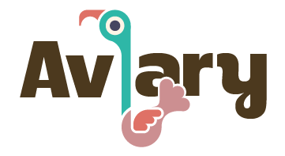

.

Aviary is a soil moisture management system that runs within a Particle mesh network consisting of an Argon and n Xenons.

## Mother Bird

[Mother Bird](https://github.com/MichaelJolley/aviary/src/mother-bird/README.md) is designed to run on a [Particle](https://particle.io) [Argon](https://docs.particle.io/datasheets/wi-fi/argon-datasheet/) board.  It listens to baby birds on its mesh network and manages them.  It is responsible for determining when a baby bird should water its planter box.

## Baby Birds

[Baby Bird](https://github.com/MichaelJolley/aviary/src/baby-bird/README.md) is designed to run on a [Particle](https://particle.io) [Xenon](https://docs.particle.io/datasheets/mesh/xenon-datasheet/) board.  It monitors soil moisture and reports to its mother bird every 2 seconds.  It also activates an attached solenoid valve if the mother bird notifies it that it is dehydrated.

## Architecture

The system is designed to run on a mesh network with one [Mother Bird](https://github.com/MichaelJolley/aviary/src/mother-bird/README.md) and an unlimited number of [Baby Bird](https://github.com/MichaelJolley/aviary/src/baby-bird/README.md)s.  Each baby bird communicates soil moisture levels to the Mother Bird with its unique device name.  The Mother Bird then responds with that devices name and a boolean denoting whether the Baby Bird should hydrate its planter box.

## Futures

Currently, Mother Bird is simply looking for soil moisture levels below an X value.  In the future we want to add:

- [ ] On Mother Bird, check weather API to determine rain chance for the next hour.  If chance is greater than X, then delay watering for up to Y hours
- [ ] Only water between hours of 6am and 6pm
- [ ] On Baby Birds, if Mother tells us to water but our moisture level is above X, disregard her request 

### Why Aviary?

The plan had been to use [chirp.io](https://chirp.io/) to communicate between the devices giving a nice "bird chirp" throughout my backyard as the devices monitored their moisture levels and reported back to a central device.  

Since this would give a nice ambience to our backyard, we decided to name each device after a different bird.  Since each device will have a unique name we decided to name each after a different cartoon bird.

Staying within the bird theme, we decided to call our mesh netowrk Aviary.

The move to a [Particle](https://particle.io) based mesh network removed the need for using chirp.io to send data.  Instead, we will likely find some way to simply play chirp noises at random times.

### Current device names:

| Board     | Name                  | Reference                                                                         |
| ---       | ---                   | ---                                                                               |
| Argon     | great_owl             | [The Secret of NIMH](https://en.wikipedia.org/wiki/The_Secret_of_NIMH)            |
| Xenon     | daffy_duck            | [Daffy Duck (Looney Tunes)](https://en.wikipedia.org/wiki/Daffy_Duck)             |
| Xenon     | tweety_bird           | [Tweety (Looney Tunes)](https://en.wikipedia.org/wiki/Tweety)                     |
| Xenon     | wood_stock            | [Woodstock (Peanuts)](https://en.wikipedia.org/wiki/Woodstock_(Peanuts))          |
| Xenon     | foghorn_leghorn       | [Foghorn Leghorn (Looney Tunes)](https://en.wikipedia.org/wiki/Foghorn_Leghorn)   |

## Release Notes

See [CHANGELOG.md](CHANGELOG.md)

## Contributors

Thanks goes to these wonderful people ([emoji key](https://allcontributors.org/docs/en/emoji-key)):

<!-- ALL-CONTRIBUTORS-LIST:START - Do not remove or modify this section -->
<!-- prettier-ignore -->
<table><tr><td align="center"><a href="https://michaeljolley.com/"> <b>Michael Jolley</b></a> <a href="https://github.com/MichaelJolley/aviary/commits?author=MichaelJolley" title="Documentation">📖</a> <a href="#ideas-MichaelJolley" title="Ideas, Planning, & Feedback">🤔</a> <a href="#design-MichaelJolley" title="Design">🎨</a> <a href="https://github.com/MichaelJolley/aviary/commits?author=MichaelJolley" title="Code">💻</a></td></tr></table>

<!-- ALL-CONTRIBUTORS-LIST:END -->

This project follows the [all-contributors](https://github.com/all-contributors/all-contributors) specification. Contributions of any kind welcome!
